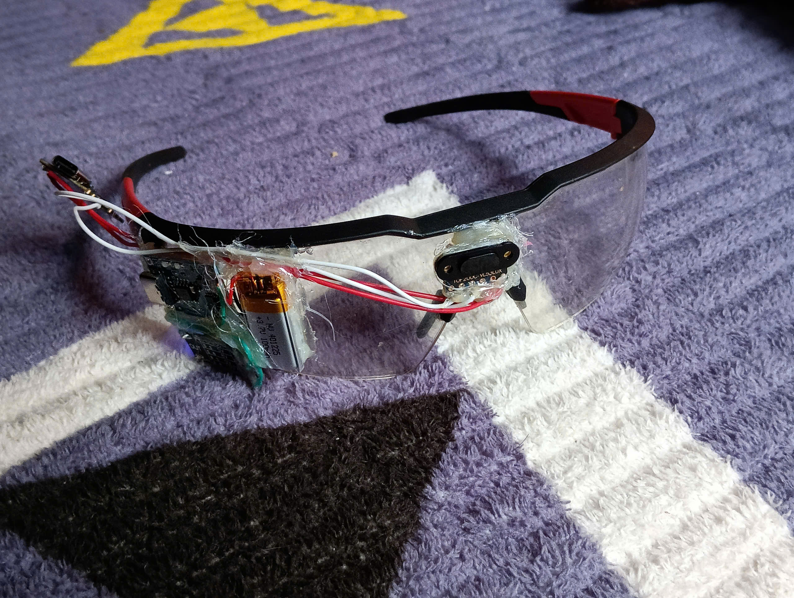
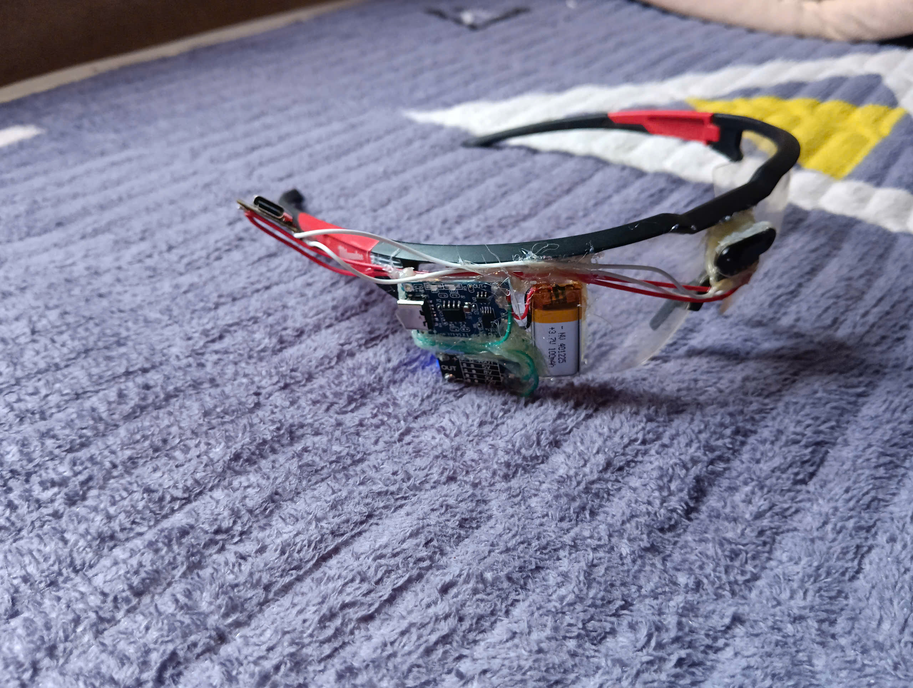
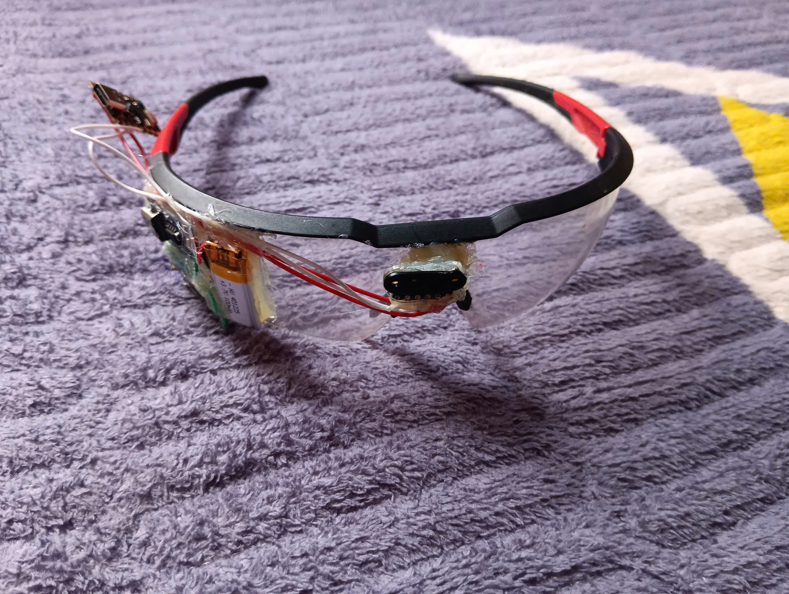

**BÁO CÁO Ý TƯỞNG DỰ ÁN “KÍNH THÔNG MINH CẢNH BÁO VẬT CẢN DÀNH CHO NGƯỜI KHIẾM THỊ” Lĩnh vực: Hệ thống Nhúng**

1. Dụng cụ
STT	Dụng cụ	Số lượng	Ghi chú
1	Esp32 c3 super mini	01	
2	Pin sạc lithium 3.7v	01	
3	Mạch sạc pin	01	
4	Mạch tăng áp điện 3.7v→5v	01	
5	Súng bắn keo nến	01	
6	Keo nến	10	
7	Máy tính laptop	01	
8	Cáp dữ liệu usb type c	01	
9	Máy hàn thiếc	01	
10	Kìm tuốt dây điện 	01	
11	Kính bảo hộ trong Milwaukee (48-73-2000A)	01	
2. Cách cài đặt 
[How to setup](https://www.scribd.com/document/616794676/esp32-c3-mini-1-datasheet-en-2578671-1)
Bước 1 cài arduino IDE trên trang web [Arduino](https://docs.arduino.cc/software/ide/#ide-v2)
Bước 2 cài driver giao tiếp [install CH304](https://github.com/justcallmekoko/ESP32Marauder/blob/master/Drivers/CH34x_Install_Windows_v3_4.EXE)
Bước 5 tải mã nguồn và giải nén mở tệp web.ino
Bước 6 kết nối esp32 với máy tính 
Bước 7 trong phần mềm Adruino IDE vào tools chọn cổng (port) đã kết nối 
Bước 8 bấm upload
